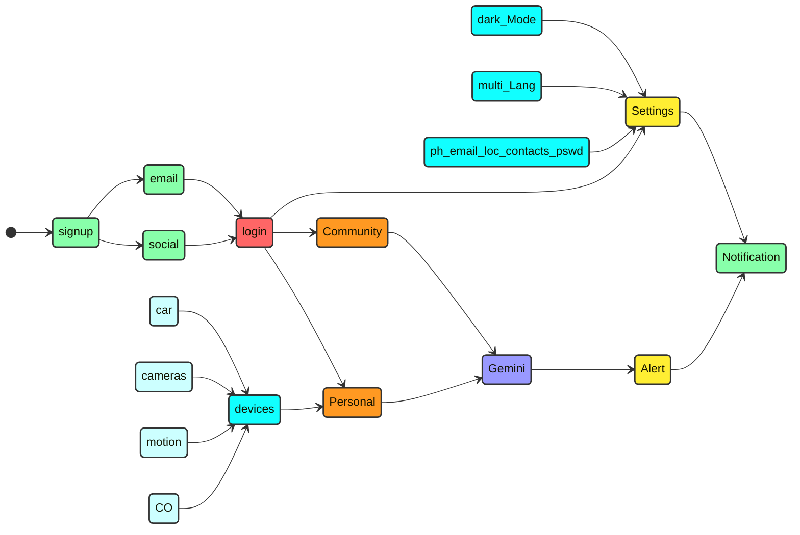
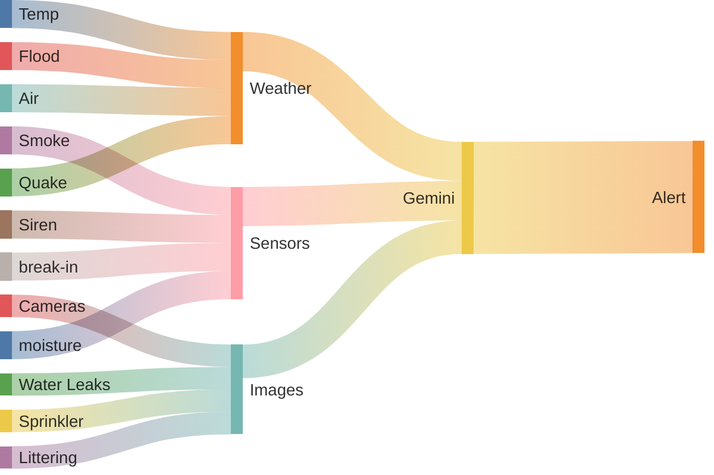
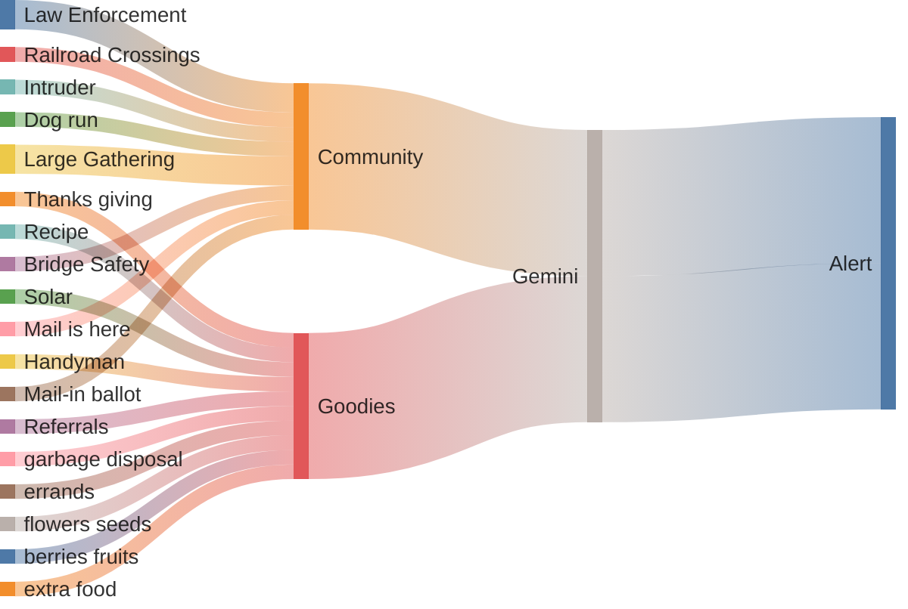
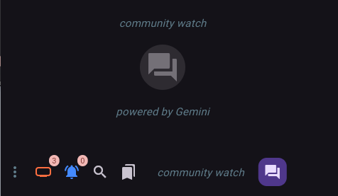

# Google Community Watch

CommunityWatch App is AI application which serves as a live alert app which reads all data, information, security alerts, local government danger alerts, warnings and mix with all neighborhood application including neighbors or community camera and other picture information shared. 

The Watch App's AI engine can process and analyze visual data from images, videos, and other sources to infer and identify security concerns, threats, or other critical information. It can then categorize this information as non-critical, alert-level, or critical, and automatically notify relevant community members through personalized alerts based on their specific interests and areas of concern.

## Author: Amit Shukla
## Connect 

## [Video Demo](https://youtu.be/Rvt6muEW-ys)
## [Live App Demo](https://amitxshukla.github.io/GoogleCommunity/)
   username: shukla@duck.com
   password: Password1

## Technology stack
    UI/UX:          Flutter
    Backend:        Firebase
    AI:             Gemini
    Location API:   Google

    API KEYs : ./watchApp/api-key.dart

## Process flow

## work flow

## Planned features
- Multilanguage: add more language support
- History: delete | retain individual chat, re-generate prompt
- Media: delete | retain individual pic, re-generate prompt
- SignIn: add phone authentication
- Notification: push, email, Text, Emergency, Badge
- Gemini: feedback, auto update RAG
- Gemini: file upload (limit per user)
- Community: auto complete to current GeoLocation | google Location API
- update API key (user to upload their own keys)
- update Alert, Community Alert, Snooze, Bookmark functionality

